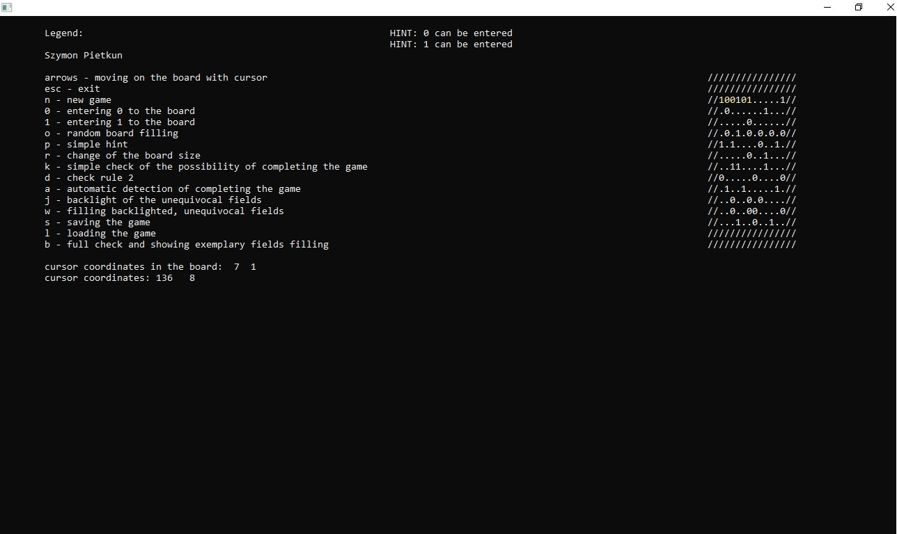

# Binary puzzle

## Visuals

## Description
Project for the University. Binary puzzle game, including hints availability, follows given rules and is a **Windows console program**. 

### Rules

**Main rules of the game:**

 - Neither column nor row can have more than two identical digits
 - Each column and row consists of the same number of digits '1' and '0'
 - Each column and row is unique

**Requirements for the project:**

 - Number of columns and rows is even and equal.
 - Forbidden instructions:  **cin/cout/printf/scanf**
 - Standard **C++** library is **forbidden**
 
### Programming language

 - C
### Notes
Options: k, d, a, j, w, s, l, b are not implemented.

## Usage

 - having fun
 - focusing Your brain on logical thinking

